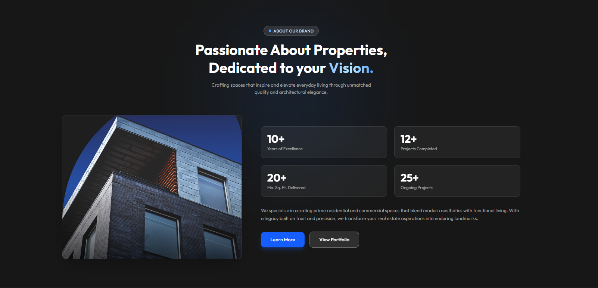

 <h1>EstateElite — Luxury Real Estate Platform</h1>
 
A <strong>modern, high-end real estate landing page</strong> crafted with <strong>React</strong>, <strong>Tailwind CSS</strong>, and smooth scroll animations via <strong>Framer Motion</strong>. The application features a cinematic luxury design with premium layout components, interactive statistics, and glassmorphic UI elements.

 &nbsp;&nbsp;
  
  

     

  <a href="https://estate-orpin.vercel.app/" target="_blank">
   Live Demo 👆
  </a>

## 🚀 What I Did

* **Modular React Architecture**: Structured a clean single-page layout divided into reusable components (`Header`, `Navbar`, `Footer`) and section-based pages (`About`, `Projects`, `Testimonials`, `Contact`).
* **Cinematic Hero Experience**: Built a dynamic, full-screen background cover dimmed by an overlay gradient to make high-end imagery pop while keeping typography completely readable.
* **Framer Motion Animations**: Integrated cinematic scroll animations using declarative properties (`whileInView`, `initial`, `viewport={{ once: true }}`) that smoothly slide and fade layout elements as users scroll.
* **Premium Glassmorphism**: Leveraged Tailwind CSS backdrop-blur utilities to design high-end, responsive UI cards like floating badge pills and frosted-glass button actions.
* **Fully Responsive Stats Grid**: Coded a fluid grid architecture that adjusts key performance metrics gracefully across mobile phones (`grid-cols-2`) and desktop computers (`md:grid-cols-4`).

## 🛠️ Tech Stack

* **React** — Component-driven application structure.
* **Tailwind CSS** — Fluid layouts, gradient overlays, responsive utilities, and glassmorphism styling.
* **Framer Motion** — Production-ready, performance-optimized micro-interactions and enter-animations.

## 💡 Creative Code Implementations

Based on the structure, this project cuts out bloated traditional CSS setups by focusing heavily on:
* **Tailwind Layout Limits**: Used classes like `w-full overflow-hidden` inside the root wrapper to easily prevent unwanted mobile horizontal scrolling without manual layout debugging.
* **Native Hover States**: Used combined utility strategies (`flex-col sm:flex-row w-full sm:w-auto`) to transition primary actions seamlessly from massive mobile tap surfaces to precise desktop links.
